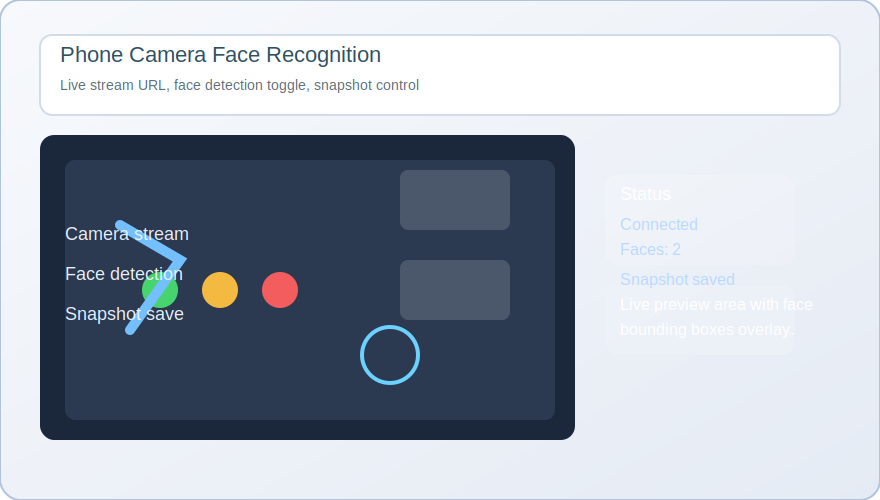

# Phone Camera Face Recognition UI

A polished Python desktop application that connects to a mobile phone camera stream and performs real-time face detection using OpenCV and Tkinter.



## Project Overview

This project is designed as a modern GitHub project entry for a computer vision portfolio.
It demonstrates how to:

- connect to a mobile phone camera stream over HTTP/MJPEG,
- process live video frames with OpenCV,
- detect faces using Haar cascade models,
- build a user-friendly Tkinter GUI,
- capture snapshots and log runtime events.

## Features

- Live phone camera streaming support.
- Real-time face detection overlay.
- Toggle face detection on/off.
- Snapshot capture saved as PNG.
- Status logging for connection and action events.

## Requirements

- Python 3.8+
- `opencv-python`
- `Pillow`
- Tkinter (built-in on most Windows Python installs)

## Installation

From the project folder:

```bash
pip install -r requirements.txt
```

## Usage

1. Start a phone camera streaming app that exposes an MJPEG stream.
2. Enter the stream URL, for example:

```text
http://192.168.1.100:8080/video
```

3. Click `Kết nối` to open the stream.
4. Enable `Bật nhận dạng khuôn mặt` to see face detection rectangles.
5. Use `Chụp ảnh` to save the current frame as a PNG file.

## Run

```bash
python phone_cam_face_gui.py
```

## Project Structure

- `phone_cam_face_gui.py` — main application script.
- `requirements.txt` — required Python packages.
- `screenshot.svg` — visual illustration for GitHub display.
- `README.md` — project documentation.

## Notes

- Ensure the phone and computer are on the same Wi-Fi network.
- If the stream does not connect, verify the URL and phone app settings.
- The application uses OpenCV Haar cascades stored in the local OpenCV installation.
